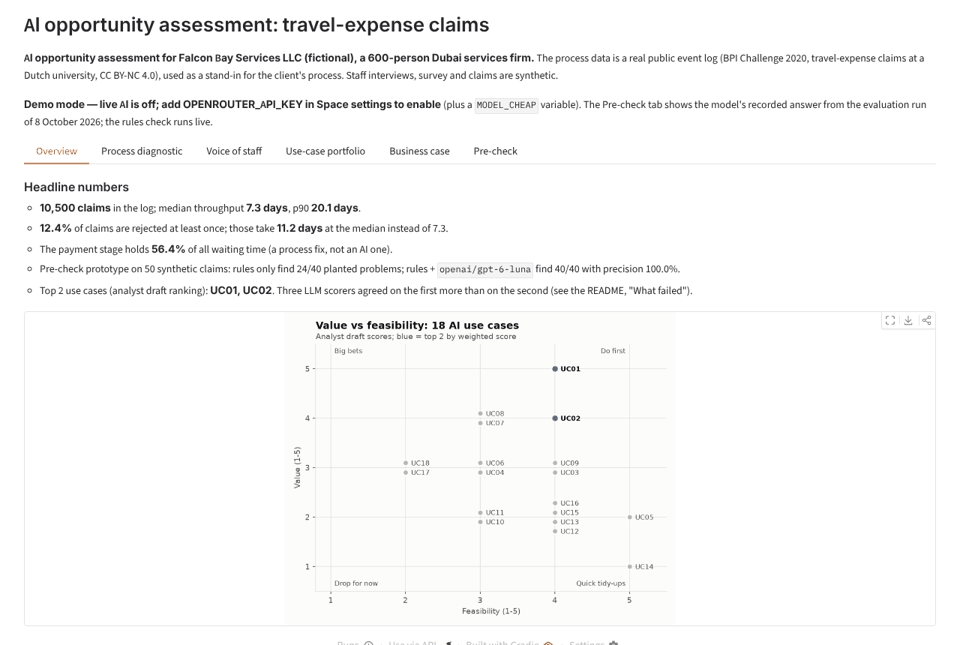
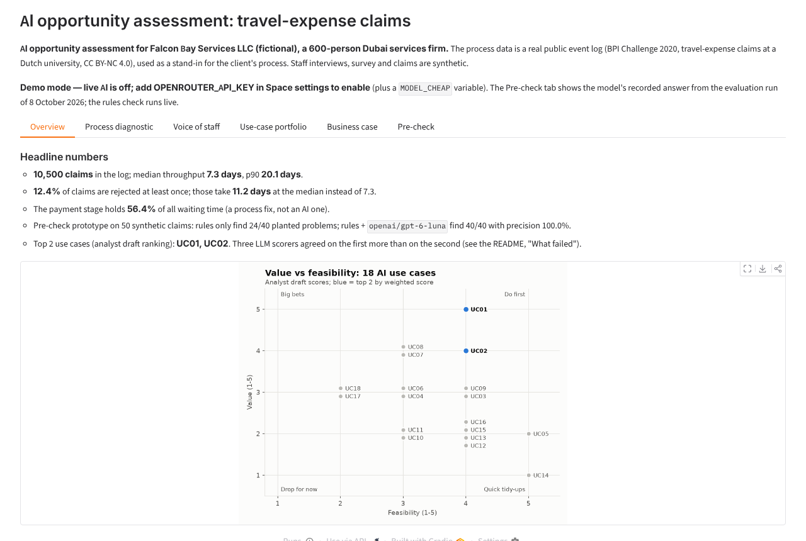
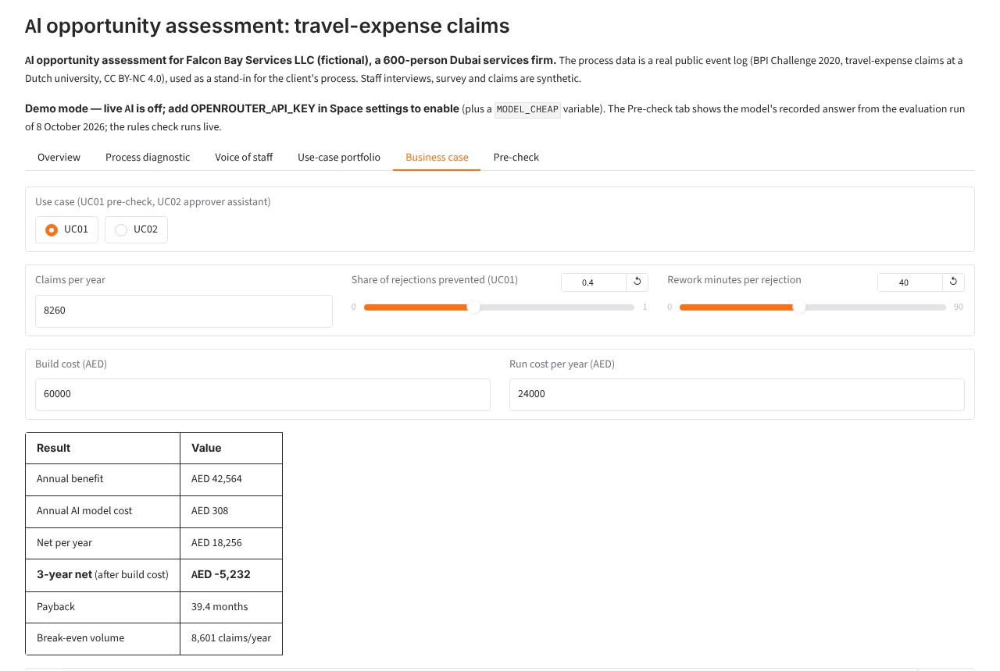
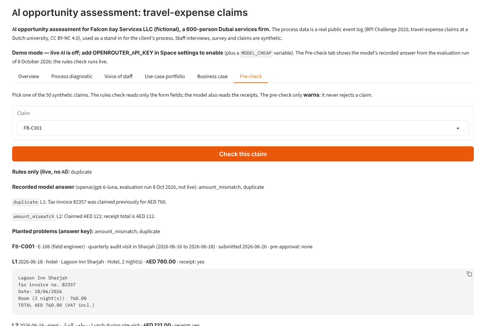
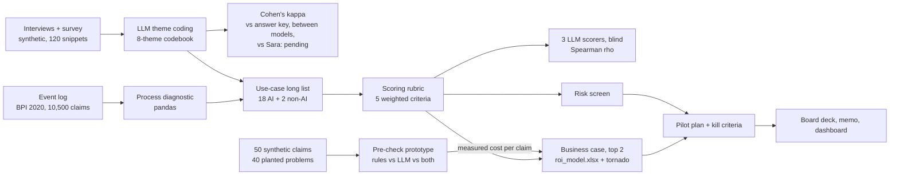

# AI opportunity assessment: from process data to a pilot with kill criteria

A small consulting engagement, end to end, for a fictional 600-person Dubai services firm: **find, rank and
cost the best AI opportunities in its travel-expense process, then design a pilot that can be stopped if it
fails.** Process mining on a real public event log, LLM-assisted interview coding, a scored use-case
portfolio, an Excel ROI model with sensitivity, a risk screen, a working prototype, a board deck and a memo.

## Demo

**Live demo:** [huggingface.co/spaces/sarahebbadj/ai-opportunity-assessment](https://huggingface.co/spaces/sarahebbadj/ai-opportunity-assessment) (works without an API key, in demo mode).

To enable live AI on your own copy: add `OPENROUTER_API_KEY` as a Space secret (and `MODEL_CHEAP` as a variable).

Screenshots from a local run of the dashboard on 8 October 2026 in **demo mode** (no API key: the
pre-check tab shows the model answers recorded in the evaluation run; the rules run live). Run it with
`python app/app.py`.


*The dashboard: headline numbers, the scored portfolio, the business case and a pre-checked claim.*


*Overview: every number comes from `evals/results/summary.json`.*


*Business case: change an assumption and the 3-year net, payback and break-even update.*


*Pre-check: rules on the form fields find the duplicate; the model also reads the Arabic receipt (AED 112) and flags the AED 121 claimed.*

Also in `docs/`: the [10-slide board deck (PDF)](docs/board_deck.pdf), the [2-page memo](docs/memo.md),
the [ROI workbook](docs/roi_model.xlsx), the [use-case portfolio](docs/use_case_portfolio.md), the
[risk screen](docs/risk_screen.md) and the [pilot plan](docs/pilot_plan.md).

## The problem

Every mid-size firm has slow back-office processes, and every one of them is now being asked "where should we
use AI?". The useful answer is not a list of ideas: it is a ranked portfolio tied to measured numbers, an
honest business case that says which assumption matters, a check of the legal and people risks, and a pilot
that someone can stop. This project does that for one process at a fictional client, Falcon Bay Services LLC.

The client is fictional. The process data is real: the **BPI Challenge 2020 travel-expense log** (10,500
claims at a Dutch university, 2017–18, CC BY-NC 4.0), used as a stand-in for the client's own claim system.
It is **not** Falcon Bay's data. Interviews, survey and test claims are synthetic.

## What it does

- **Process diagnostic** in plain pandas: throughput time, waiting time per step and per role, process variants,
  rejection and resubmission loops. 20 of the numbers are checked against a hand-computed 20-case log.
- **Voice of staff**: three LLMs code 120 interview and survey snippets into an 8-theme codebook, one snippet
  per call; agreement is measured with Cohen's κ. A blind coding sheet for Sara is ready.
- **Use-case portfolio**: 18 AI use cases and 2 non-AI changes, each tied to a measured number; scored on five
  weighted criteria; then re-scored blind by three LLMs to test how robust the ranking is (Spearman ρ).
- **Business case** for the top 2 in a live-formula Excel model: benefit, cost, 3-year net, payback, break-even
  volume and a tornado chart. The model cost per claim comes from the prototype's measured OpenRouter cost.
- **Prototype**: a receipt and policy pre-check on 50 synthetic claims with 40 planted problems: rules only vs a
  model vs both; precision, recall and cost per 100 claims.
- **Risk screen** (EU AI Act as a benchmark, NIST AI RMF, UAE PDPL) and a **6-week pilot plan with kill criteria**.

## Architecture



| Part | Tech |
|---|---|
| Diagnostic | pandas on a CSV converted from XES (`eventlog.py`, `diagnostic.py`); no process-mining library |
| Models | OpenRouter through the OpenAI SDK, JSON mode, low reasoning effort, every call traced with cost |
| Statistics | Cohen's κ and Spearman's ρ written out by hand (`agreement.py`) |
| ROI | One formula string per result, evaluated in Python and written into Excel (`roi.py`, openpyxl) |
| Charts, deck | matplotlib; deck HTML printed to PDF with Playwright (`scripts/build_deck.py`) |
| Dashboard | Gradio, 6 tabs; demo mode without a key |
| Tests | pytest (76 tests, no network), ruff, GitHub Actions |

More detail and the design decisions: [docs/architecture.md](docs/architecture.md).

## Results

All runs on **8 October 2026**. Rebuild every number below (no model calls) with `python -m evals.run rebuild`;
the model runs are `python -m evals.run themes|rubric|precheck --model <cheap|main|judge>`. Models:
`openai/gpt-6-luna` (`MODEL_CHEAP`), `anthropic/claude-sonnet-5.5` (`MODEL_MAIN`), `google/gemini-3.8-flash`
(`MODEL_JUDGE`). Each model ran once per task. Files: `evals/results/` (`summary.json`, per-run CSV/JSONL,
`traces.jsonl` with every call's tokens, cost and latency).

**Process diagnostic** (BPI 2020 Domestic Declarations, n = 10,500 claims, 56,437 events):

| Measure | Value |
|---|---|
| Throughput time, median / p90 | 7.3 / 20.1 days |
| Claims rejected at least once | 1,301 (12.4%); administration rejected first in 833 of them (64.0%) |
| Throughput with / without a rejection (median) | 11.2 / 7.3 days (p90: 42.4 / 17.3) |
| Claims resubmitted | 1,019 (9.7%) |
| Share of all waiting time: payment stage / supervisor / administration | 56.4% / 17.4% / 12.3% |
| Process variants; share on the most common one | 99; 44.0% |
| Annual volume used for the ROI (claims starting in 2018); their rejection rate | 8,260; 13.0% |
| Hand-computed fixture (`tests/fixtures/README.md`) | **20/20 checks match** |
| Reproducibility | One command rebuilds every number from the raw file (`python -m evals.run rebuild`) |

**Voice of staff: LLM theme coding** (120 snippets, one theme each, one snippet per call, 0 errors):

| Coder | Agreement with the answer key | Cohen's κ | On 92 "clear" / 28 "mixed" snippets | Cost |
|---|---|---|---|---|
| `openai/gpt-6-luna` | 94.2% (113/120) | 0.933 | 98.9% / 78.6% | US$0.010 |
| `google/gemini-3.8-flash` | 96.7% (116/120) | 0.962 | 98.9% / 89.3% | US$0.113 |
| `anthropic/claude-sonnet-5.5` | 97.5% (117/120) | 0.971 | 100% / 89.3% | US$0.316 |
| Between models (3 pairs) | 94.2%–95.8% | 0.933–0.952 | | |
| **Sara's blind hand coding** | **pending** ([`evals/sara_coding_sheet.csv`](evals/sara_coding_sheet.csv)) | target κ ≥ 0.6 | | |

The answer key is the theme each snippet was written to express, by the same coding agent that wrote the
snippets: **these κ values are an upper bound, not human agreement.** Most disagreements are on snippets
written as "mixed" (manual work vs receipts, status vs manual work). The themes were spread evenly by design
(14–16 snippets each), so the theme shares do not rank pain points.

**Use-case portfolio: rubric robustness** (18 AI use cases; [full table](docs/use_case_portfolio.md)):

| Scorer | Spearman ρ with the analyst draft | Same top 2? | Where it put the draft's #1 (UC01) / #2 (UC02) |
|---|---|---|---|
| Analyst draft (written by the coding agent for Sara to review) | — | — | 1 / 2 |
| `anthropic/claude-sonnet-5.5` | 0.79 | No (1 of 2) | 2 / 8 |
| `openai/gpt-6-luna` | 0.64 | No (0 of 2) | 8 / 9 |
| `google/gemini-3.8-flash` | 0.54 | No (0 of 2) | 3 / 9 |

Between the three models ρ = 0.74–0.83. Every scorer put the per-employee fraud score (UC18) last. See
"What failed" for the two big rank changes.

**Pre-check prototype** (50 synthetic claims; 40 planted (claim, problem) pairs: 24 visible in the form
fields, 16 only in the receipt text; 20 clean claims, 10 of them close to a limit):

| System | Precision | Recall (found / 40) | Receipt-only problems found | Cost per 100 claims | Avg latency |
|---|---|---|---|---|---|
| Rules only (form fields, no AI) | 100% | 60% (24) | 0/16 | US$0 | < 1 ms |
| `openai/gpt-6-luna` | 100% | **100% (40)** | 16/16 | **US$0.016** | 2.7 s |
| `google/gemini-3.8-flash` | 100% | 100% (40) | 16/16 | US$0.154 | 6.7 s |
| `anthropic/claude-sonnet-5.5` | 100% | 100% (40) | 16/16 | US$0.528 | 2.8 s |

Rules + each model gave the same numbers as the model alone. **The target (beat the rules on recall without
lower precision) is met, but the set is at the ceiling**: it shows that reading receipts finds what the rules
cannot, and what it costs, but it cannot rank the models. The rules' perfect field recall is by construction
(the same agent wrote the policy, the claims and the rules).

**Business case** (top 2 by the analyst draft; [workbook](docs/roi_model.xlsx); money in AED, 3 years, no discounting):

| | UC01 receipt and policy pre-check | UC02 approver assistant |
|---|---|---|
| Annual benefit / net per year | 42,564 / 18,256 | 80,452 / 65,446 |
| **3-year net** after build cost | **−5,232** | **156,339** |
| Payback | 39 months | 7 months |
| Break-even | 8,601 claims a year (volume used: 8,260), or 42% of rejections prevented (assumed 40%) | 0.53 approver minutes saved per approval (assumed 1.5) |
| Input that moves the 3-year net most | Clerk minutes saved per claim: −54,792 to +93,888 | Approver minutes saved: −4,566 to +397,696 |

Measured inputs: volume, rejection rate and approvals per claim (event log), and the model cost per claim
(US$0.00016, `gpt-6-luna` pre-check run). Everything else is a labelled assumption with a low and a high value.
The workbook's formulas were recalculated in LibreOffice and match the Python results (10/10 values checked).

**Cost of this evaluation:** US$1.03 for 633 model calls (smoke tests included), 0 errors, 0 truncated answers
(`evals/results/traces.jsonl`; budget US$2).

Caveats: synthetic staff data and claims written by the same coding agent that built the checks; Arabic
receipts and texts not yet reviewed by a native speaker; one run per model; `temperature=0` is sent but not
every model supports it, so a re-run can differ; the event log is a stand-in for the client's process.
The `--dry-run` outputs in `evals/dry_run/` use a fake model and are **not results**.

## What failed and what I changed

Found by the coding agent while building and running the first version (8 October 2026):

- **The rubric's #2 was not robust, and the rubric missed a question.** All three model scorers put UC02
  (approver assistant) 8th or 9th, against 2nd in the draft: they read the median supervisor wait (0.9 days)
  as a bounded problem that plain reminders mostly solve. All three put UC06 ("where is my claim?" chat) 1st or
  2nd, against 10th in the draft, which marked it down because the status already exists and can be shown
  without AI. Neither view is wrong; the rubric simply has no "is AI needed?" criterion. I did **not** change the
  draft scores after seeing the models' scores. Instead the recommendation changed: switch on the existing
  reminders now (no AI) and test the AI summary cheaply; show claim status in the portal before considering a
  chat. Next version: add an "AI necessity / simpler alternative" criterion and re-score.
- **The pre-check test set was too easy.** All three models found 40/40 with no false flags, so the set cannot
  separate them. I did not change the set after seeing the result. Next: a second, harder set written before
  any run (photographed receipts with OCR noise, tips and service charges, ambiguous dates), plus real claims
  labelled by clerks in the pilot's shadow week.
- **The ROI says "not yet" for the top-ranked idea.** At the base case, UC01 is 5,232 AED short of breaking even
  over 3 years, and the input that moves it most (clerk minutes saved per claim) is an assumption. So the pilot
  measures exactly that, and its kill criteria use the break-even values from the model.
- **The official download was down.** 4TU.ResearchData answered "storage temporarily unavailable" (HTTP 503)
  during the build, so the log was converted from a public GitHub mirror of the same file (10,500 cases and
  56,437 events, as published); the script still downloads and MD5-checks the official file.
- **A process-level run problem.** Two copies of the gemini theme-coding run overlapped for a few minutes after a
  runner restart; the duplicate was stopped, its 26 calls (about US$0.03) are in the traces and in the cost above.
- **Chart and deck fixes.** Use cases with the same scores overlapped on the 2×2 chart (now stacked); identical
  "rules + model" bars were removed from the pre-check chart; the deck no longer suggests the evenly spread
  synthetic themes rank pain points.

> TODO (Sara): after your review, add what you changed and why (for example after your blind coding of the 120
> snippets, or after reviewing the analyst draft scores).

## How to run

```bash
python -m venv .venv && source .venv/bin/activate     # Windows: .venv\Scripts\activate
pip install -e ".[dev]"
pytest -q && ruff check .                             # 76 tests, no network, no keys, no raw data needed
python -m opportunity_assessment.eventlog && python -m evals.run rebuild   # download the log, rebuild every number
python app/app.py                                     # dashboard; demo mode if no key is set
```

Keys go in `Portfolio Projects/.env` (or a local `.env`), see [`.env.example`](.env.example). Model runs:
`python -m evals.run themes --model cheap` (add `--limit 10` for a smoke test, `--dry-run` for the fake model),
`python -m evals.run rubric --model judge`, `python -m evals.run precheck --system llm --model main`.
Deck: `pip install -e ".[docs]"` then `python scripts/build_deck.py` (set `CHROMIUM_PATH` to use an installed
Chromium). Claims: `python data/claims/make_claims.py` regenerates the 50 claims (seed 42).

## Data and licence

- **Event log:** BPI Challenge 2020, Domestic Declarations, 4TU.ResearchData (Eindhoven University of
  Technology), [CC BY-NC 4.0](https://creativecommons.org/licenses/by-nc/4.0/): attribution, **non-commercial
  use only**. It is downloaded by a script and **not committed**; only derived aggregate numbers are.
- **Synthetic data:** interviews, survey, codebook, claims, policy and use cases were written for this project.
  No real people or companies; Falcon Bay Services LLC is fictional.
- Details: [data/README.md](data/README.md). Code: MIT licence.

## How I used AI agents

> DRAFT for Sara to check and edit before publishing.

- I (Sara) set the brief and the acceptance tests in `BUILD_SPEC.md`: the fictional client, the workstreams,
  the evaluation table (fixture checks, κ, Spearman ρ, precision/recall vs a rules baseline, cost) and the
  definition of done.
- A coding agent (Claude) generated the code, the synthetic data, the analyst draft scores, the tests and the
  documents on 8 October 2026, and ran the live evaluation on OpenRouter (US$1.03).
- I will review, run and change it. > TODO (Sara): list what you changed after reviewing.
- > TODO (Sara): code the 120 snippets blind in `evals/sara_coding_sheet.csv`, then re-run
  `python -m evals.run rebuild` to get the real human–LLM κ.
- > TODO (Sara): review the analyst draft scores in `data/portfolio/scores_analyst_draft.csv` and say which
  ones you changed.

## Limitations and next steps

- The process data is from a university, not a Dubai services firm; the volume and the rejection rate are a
  stand-in. Replace them with the client's own claim-system export.
- The interviews, survey and claims are synthetic and written by the same agent that built the checks, so the
  κ values are an upper bound and the pre-check set is too easy. Sara's blind coding and a harder, pre-registered
  claim set are the next two steps.
- The prototype reads receipt **text**; real receipts are photos. The receipt-reading cost in the ROI model is
  an assumption until an OCR or vision step is measured.
- One run per model; no confidence intervals yet.
- Next: an "is AI needed?" rubric criterion, a second process (support tickets) for comparison, and (if trial
  access exists) the pre-check as a Microsoft Copilot Studio agent compared with the Python version.
