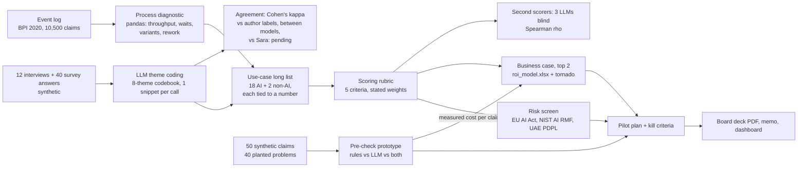

# Architecture

## The engagement as a pipeline

## Code map

| Step | Code | Output |
|---|---|---|
| Download + convert the log | `src/opportunity_assessment/eventlog.py` | `data/raw/domestic_declarations.csv` (not committed) |
| Process diagnostic | `diagnostic.py` (plain pandas) | `evals/results/diagnostic_*.csv`, `diagnostic_summary.json` |
| Theme coding | `themes.py` + `llm.py` | `evals/results/theme_codes_<model>.csv` |
| Agreement statistics | `agreement.py` (kappa, Spearman, written out by hand) | inside `summary.json` |
| Use-case scoring | `rubric.py` | `evals/results/rubric_scores_<model>.csv`, `docs/use_case_portfolio.md` |
| Pre-check prototype | `precheck.py` | `evals/results/precheck_<model>.jsonl` |
| ROI model | `roi.py` (one formula text, used by Python and written into Excel) | `docs/roi_model.xlsx` |
| Charts, workbook, summary | `report.py` | `docs/charts/*.png`, `evals/results/summary.json` |
| Command line | `evals/run.py` | all of the above |
| Dashboard | `app/app.py` (Gradio) | reads `summary.json` |

## Model calls

`llm.py` is the only module that calls a model (OpenRouter, OpenAI-compatible SDK). Every call asks for low
reasoning effort, uses JSON mode and up to 1,500 output tokens, and is logged to `traces.jsonl` with model,
tokens, cost (OpenRouter `usage.cost`), latency and outcome. A budget guard (`MAX_COST_PER_RUN_USD`) stops a
run cleanly before the next call once the run has spent its budget. Tests and `--dry-run` use `FakeLLM`.

| Task | Calls | Why one item per call |
|---|---|---|
| Theme coding | 120 per model | A snippet's code must not depend on the snippets next to it |
| Rubric scoring | 18 per model | Each use case is scored on its own, so the model cannot rank them against each other |
| Pre-check | 50 per model | One claim at a time, like the real product |

## Design decisions

- **Plain pandas, no process-mining library.** pm4py is AGPL-3.0 and hides the arithmetic. Every number
  here can be checked by hand, and 20 of them are (`tests/fixtures/README.md`).
- **The answer keys never reach a model.** Author labels live in `evals/`, gold problems are removed by
  `precheck.claim_for_model()`, and tests check both prompts.
- **The pre-check warns, it never rejects.** Staff asked for this in the interviews, and it keeps the use
  case out of "automated decision about employees" territory (see `risk_screen.md`).
- **Rules and the model together.** The rules do the arithmetic (limits, dates, deadlines) reliably; the model
  reads the receipts. The evaluation reports all three: rules only, model only, and both.
- **One formula, two places.** Each ROI result is a formula string in `roi.py`; Python evaluates it and
  the Excel export writes the same text with cell addresses, so the workbook cannot drift from the code.
